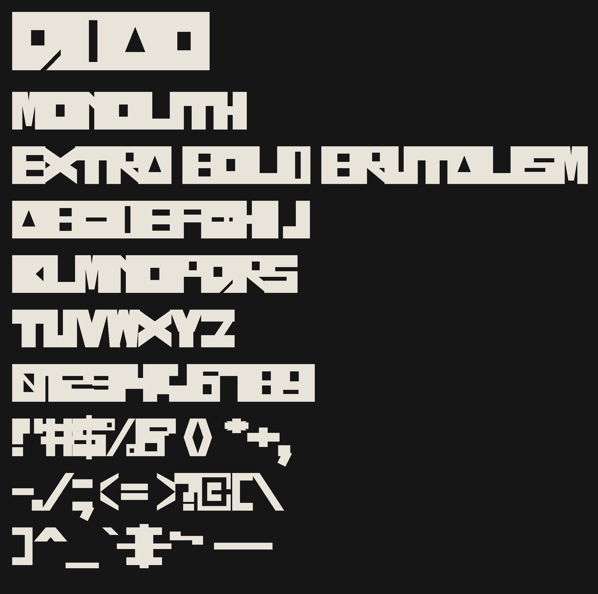
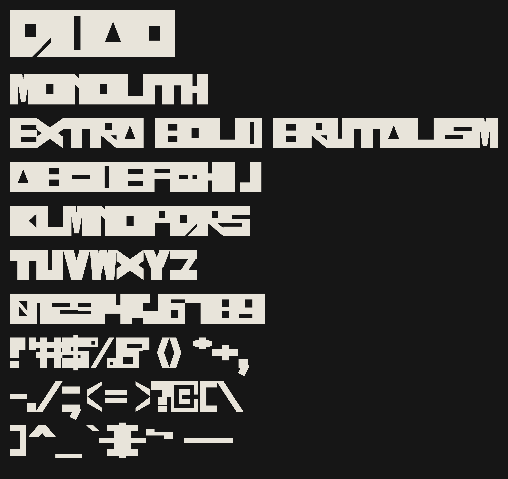
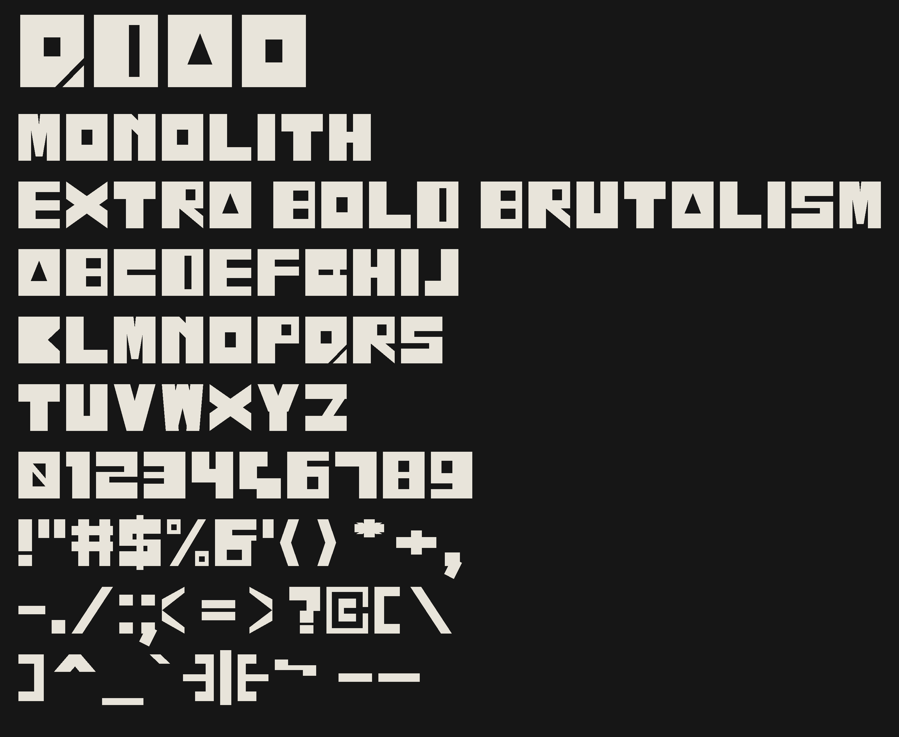
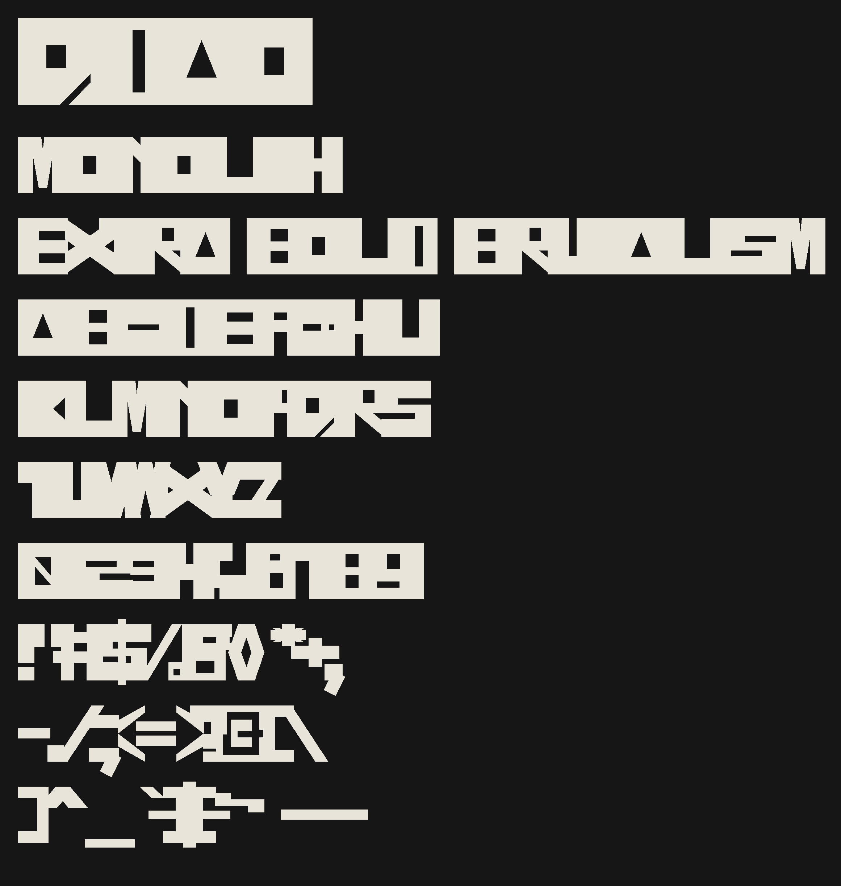

# MONOLITH

A brutalist extra-bold, all-slabs-and-slits display sans. Every letterform is
straight lines: rectangles, polygons, and diagonal slabs — no curves anywhere.
Adjacent letters overlap by design; turn the **spacing** up (below) if you
want them to breathe.



## Glyph set

`A–Z` double-encoded so `a–z` type as the caps, `0–9` (the zero carries an
attached diagonal slash to stay distinct from `O` at small sizes), and full
printable ASCII punctuation & symbols plus en/em dashes — 71 glyphs covering
97 encoded characters, plus a `.spaced` alternate for every glyph except the
space (70 alternates; 142 glyphs total with .notdef).

Component-era checkouts converge by rerunning the macro (stale `a–z`
glyphs are auto-deleted by the `KEEP` prune). Accepted tradeoffs: old
Acrobat-Distiller PDF workflows may garble clipboard casing; Turkish `i`
renders as dotless `I` (unchanged behavior).

## Install

Grab the built fonts from [`fonts/`](fonts/):

- `MONOLITH-ExtraBold.otf` — print / desktop (unkerned block cut)
- `MONOLITH-ExtraBold.ttf` — web / apps (unkerned block cut)
- `MONOLITH-Variable.ttf` — variable: continuous spacing via `SPAC`,
  continuous kerning via `KERN`

## Spacing

Two ways to loosen the default overlap (advance = width − 30):

### Variable `SPAC` axis

`MONOLITH-Variable.ttf` exposes spacing as a continuous slider. The axis
value is extra advance per glyph, in font units:

| SPAC | Look |
| ------ | ------ |
| **0** (default) | shipped tight look — letters overlap by 30 |
| **30** | ink edges exactly touch |
| **130** | fully loose — matches the `.spaced` alternates |

- **CSS:** `font-variation-settings: "SPAC" 30;`
- Named instances (*Tight*, *Touching*, *Spaced*) also appear in app style
  menus.
- Every glyph gets the same delta, `space` included; combining `SPAC` with
  ss01 double-spaces (both add their delta).



### Loose spacing (ss01)

By default the letters touch and overlap (advance = width − 30). Every glyph
has a `.spaced` alternate with 50-unit sidebearings, substituted by:

- **CSS:** `font-feature-settings: "ss01" on;` (also `"salt"` works)
- **Affinity apps:** Character panel → hamburger menu → *Show Typography* →
  *Stylistic Sets* → **Loose spacing**
- **Canva:** no OpenType-feature UI — use the letter-spacing slider instead.



## Kerning

MONOLITH ships **kern-free by default** — the pure block look is the default
everywhere. On top of that, the variable font carries a **`KERN` axis
(0–100, default 0)** that scales 486 seam-metric kern pairs (computed from
where each letter's edge recedes from the vertical — A/V, A/J, T/…), from
no kerning at 0 to full kerning at 100:

- **CSS:** `font-variation-settings: "KERN" 100;`
- Values interpolate: `KERN 50` applies every kern at half strength.
- The statics have no kerning at all (their instance drops the feature).
- The same 486 pairs live in the Glyphs source's native kerning table —
  open Window ▸ Kerning to inspect or tweak them.



## Rebuilding

The font source is [`MONOLITH.glyphs`](MONOLITH.glyphs). The letterforms live
as pure Python data in [`src/monolith/design.py`](src/monolith/design.py);
the Glyphs-side builder turns that data into the `.glyphs` file.

**Regenerate the fonts** (requires [Glyphs](https://glyphsapp.com) — Glyphs
generates the source and the statics. The variable font is assembled
downstream with fontTools: Glyphs 4.1's VF export rejects this document
("Invalid axis range"), and SPAC is metric-only anyway, so varLib builds
the base VF from the exported static and kern_axis finishes it):

1. Rebuild the source and export the statics headlessly (requires
   [Glyphs](https://glyphsapp.com) 4.1 on macOS + the `glyphs` uv group):

       uv sync --group glyphs
       uv run --group glyphs -- glyphs run --app 4 scripts/rebuild_cli.py --input MONOLITH.glyphs
       uv run --group glyphs -- glyphs run --app 4 -c '
st = next(i for i in Glyphs.font.instances if i.name == "ExtraBold")
st.generate("TTF", "fonts/MONOLITH-ExtraBold.ttf")
st.generate("OTF", "fonts/MONOLITH-ExtraBold.otf")
print("statics exported (unkerned)")
' --input MONOLITH.glyphs

   The statics export targets the ExtraBold instance only (same
   `instance.generate` calls the GUI macro uses) — a plain
   `glyphs export` would also emit Touching/Spaced/Variable cuts that
   collide with the fontTools variable chain below. If `glyphs run`
   complains about a missing Python framework, add
   `--python <path-to-a-Python-framework-with-PyObjC>` (or set the
   framework once in Glyphs Settings).

   `MONOLITH.glyphs` is rewritten in place — including the two `SPAC`
   masters and the native kerning pairs — and the statics land in `fonts/`
   (unkerned: the ExtraBold instance drops the `kern` feature).
   Fallback without `glyphs-cli`: open `MONOLITH.glyphs` in Glyphs, paste
   [`scripts/macro_bootstrap.py`](scripts/macro_bootstrap.py) into
   Window ▸ Scripting Window and press **Run**.
2. Assemble and finish the variable font:

   ```sh
   uv run python -m monolith.variable   # base VF from the static (varLib)
   uv run python -m monolith.kern_axis  # KERN axis + HVAR + Tight -> fonts/MONOLITH-Variable.ttf
   ```

**Regenerate the specimen images** (no Glyphs needed):

```sh
uv sync
uv run monolith-specimen        # writes specimens/specimen{,-spaced}.png
uv run monolith-specimen --spac 30
# + specimen-spac30.png, specimen-kern100.png and the axis ramp sheets
#   (specimen-kern-ramp.png: KERN 0-100 in steps of 10;
#    specimen-spac-ramp.png: SPAC 0-130 in steps of 10) — needs the variable font
```

Specimen rows are laid out by shaping the exported binaries with HarfBuzz,
so the PNGs show the font's real spacing — default (kern-free) advances,
`ss01` substitution for the loose sheet, `SPAC`/`KERN` variations for the
axis sheets. Nothing is hand-adjusted.

## Development

```sh
uv sync
uv run pytest          # design invariants + SPAC font + shaping + render smoke test (no Glyphs)
uv run ruff check .
```

`tests/test_design.py` guards the invariants that keep the font legible:
full printable-ASCII coverage, a minimum-thickness tripwire on diagonal
strokes, counter presence for the confusable-prone letters, and the
tight/spaced advance math. `tests/test_variable.py` guards both axes:
axis metadata, the GDEF VariationStore wiring behind `KERN`, per-glyph
advance math at 0/30/130, and outline invariance. `tests/test_shaping.py`
runs the exported binaries through HarfBuzz to prove everything ships
unkerned by default, that `KERN` applies and interpolates, and that it
composes with `SPAC`.

## License

- **The font** (`MONOLITH.glyphs`, `fonts/*`): [SIL Open Font License 1.1](LICENSE.txt)
  — "MONOLITH" is a Reserved Font Name.
- **The code** (`src/`, `scripts/`, `tests/`): [MIT](LICENSE-CODE)
